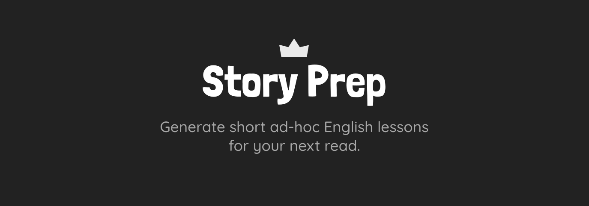

## Intro

What if you could learn another language by reading your favorite authors? And I don't talk about just reading them with a dictionary at hand. I mean lessons that teach just the necessary for you to enjoy that particular story 🗝🚪.

## Features

- Generate custom vocabulary sheet based on any story you provide.
- Generate a companion audio lesson.
- Download lesson as PDF.
- Download lesson as audio.

## Setup

Just make sure you set the `CLARIFAI_PAT` env var. [Here](https://docs.clarifai.com/clarifai-basics/authentication/personal-access-tokens/) is how you can get a Personal Access Token (PAT).
